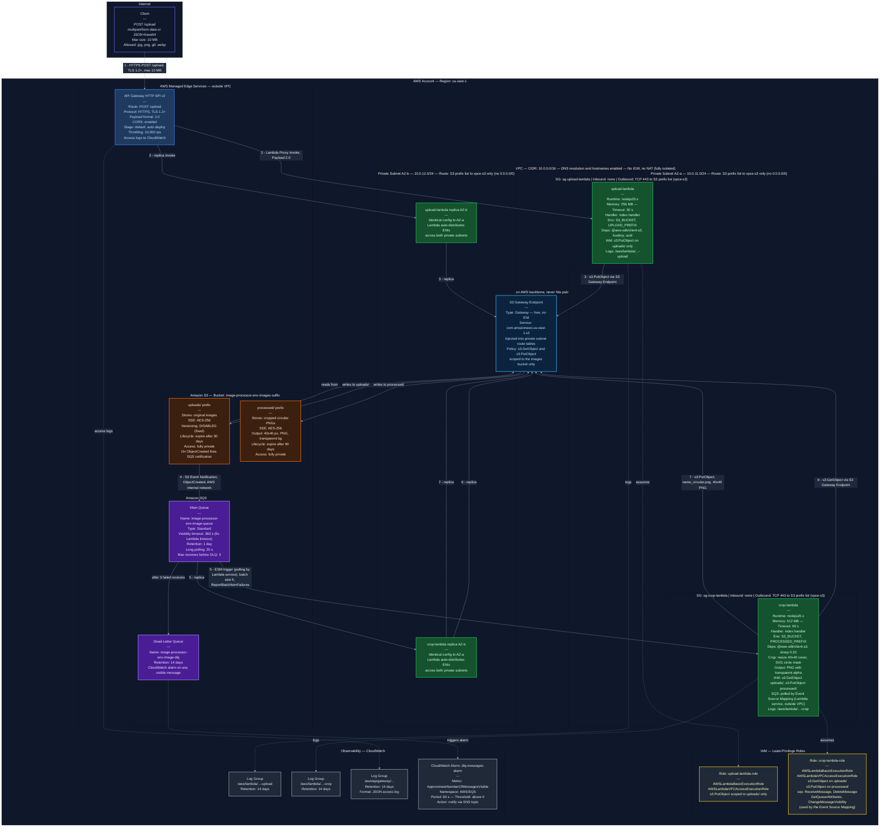

# Procesador de imágenes en AWS

Arquitectura serverless que recibe imágenes por API, las guarda en S3 y genera una versión circular de 40x40 px con Lambda. Toda la infraestructura se define con Terraform y se despliega con el mismo código en tres entornos (dev, qa y prod), con las Lambdas aisladas en una VPC privada sin salida a internet.

## Tabla de contenidos

- [Características](#características)
- [Tecnologías utilizadas](#tecnologías-utilizadas)
- [Arquitectura](#arquitectura)
- [Estructura del repositorio](#estructura-del-repositorio)
- [Requisitos previos](#requisitos-previos)
- [Instalación](#instalación)
- [Despliegue](#despliegue)
- [Uso](#uso)
- [Reparto del equipo](#reparto-del-equipo)
- [Contribución](#contribución)
- [Documentación](#documentación)

## Características

- **Subida por API:** `POST /upload` acepta jpg, png, gif y webp de hasta 4 MB, como `multipart/form-data` o JSON con base64.
- **Recorte circular automático:** cada imagen se convierte en un PNG de 40x40 px con fondo transparente en `processed/`.
- **Procesamiento asíncrono con reintentos:** S3 avisa a una cola SQS; los mensajes que fallan 3 veces pasan a una cola de mensajes fallidos (DLQ).
- **Fallos parciales por lote:** si una imagen de un lote falla, solo se reintenta esa imagen.
- **Red aislada:** las Lambdas corren en subnets privadas sin NAT ni Internet Gateway y llegan a S3 por un endpoint gateway.
- **Tres entornos con el mismo código:** dev, qa y prod solo cambian en sus archivos de variables (límites de la API, concurrencia, CIDR de la VPC).
- **Mínimo privilegio:** cada Lambda tiene su propio rol IAM y su propio Security Group.

## Tecnologías utilizadas

- **AWS:** API Gateway (HTTP API v2), Lambda, S3, SQS, VPC con endpoint gateway de S3, IAM y CloudWatch Logs.
- **Infraestructura como código:** Terraform >= 1.11 con el proveedor `hashicorp/aws` ~> 5.0 y estado remoto en S3.
- **Lambdas:** Node.js 20 (runtime `nodejs20.x`), AWS SDK for JavaScript v3, busboy (upload-lambda) y sharp 0.33 (crop-lambda).
- **Pruebas:** test runner integrado de Node.js (`node:test`).

## Arquitectura


## Cambios realizados en el diagrama posteriores al análisis correspondiente
1. Eliminación de ambos NAT Gateways debido a sobrecostos e inutilidad porque no se necesita salir a internet.
2. Eliminamos el SQS Interface Endpoint por ser un costo innecesario. El costo escala por zona de disponibilidad...
3. El bucket uploads/ con versionado y expiración a 30 días está mal configurado. La regla de expiración solo afecta a la versión actual y deja un delete marker. Las versiones anteriores quedan para siempre y el almacenamiento crece sin límite.
## Estructura del repositorio

```text
.
├── api-gateway/         Documentación de la API (README.md)
├── docs/                Diagrama de arquitectura y acuerdos del equipo
├── infra/               Código Terraform (root module plano)
│   ├── backend/         Configuración del estado remoto por entorno
│   ├── environments/    Variables de cada entorno (*.tfvars)
│   └── scripts/tf.sh    Script para ejecutar Terraform en un entorno
└── lambdas/
    ├── upload/          upload-lambda: recibe la imagen y la guarda en uploads/
    └── crop/            crop-lambda: recorta la imagen y la guarda en processed/
```

## Requisitos previos

| Herramienta | Versión | Para qué |
|---|---|---|
| [Git](https://git-scm.com/) | cualquiera reciente | Clonar el repositorio; en Windows incluye Git Bash |
| Bash | Git Bash en Windows | Ejecutar `build.sh` y `infra/scripts/tf.sh` |
| [Node.js](https://nodejs.org/) y npm | Node.js >= 20 | Instalar dependencias, probar y empaquetar las Lambdas |
| [Terraform](https://developer.hashicorp.com/terraform/install) | >= 1.11 | Desplegar la infraestructura |
| [AWS CLI v2](https://docs.aws.amazon.com/cli/latest/userguide/getting-started-install.html) | 2.x | Credenciales y revisión de resultados en S3 y CloudWatch |

Además se necesita:

- Credenciales de AWS configuradas (`aws configure`) con permisos para crear los recursos en `us-east-1`.
- El nombre del bucket del estado remoto de Terraform. Se pide al equipo y **nunca se guarda en el repositorio**.

## Instalación

```bash
# 1. Clonar el repositorio
git clone https://github.com/rprincipeg/AWS-Lambda-Integration.git
cd AWS-Lambda-Integration

# 2. Instalar las dependencias de cada Lambda
(cd lambdas/upload && npm ci)
(cd lambdas/crop && npm ci)

# 3. Ejecutar las pruebas
(cd lambdas/upload && npm test)
(cd lambdas/crop && npm test)
```

## Despliegue

Cada entorno se despliega desde su propia rama, con sus propias variables y su propio estado remoto:

| Entorno | Rama | Variables | Comando |
|---|---|---|---|
| dev | `develop` | `infra/environments/dev.tfvars` | `bash scripts/tf.sh dev apply` |
| qa | `qa` | `infra/environments/qa.tfvars` | `bash scripts/tf.sh qa apply` |
| prod | `main` | `infra/environments/prod.tfvars` | `bash scripts/tf.sh prod apply` |
| sandbox personal | cualquiera | `infra/environments/dev.tfvars` | `bash scripts/tf.sh sandbox:<nombre> apply` |

El sandbox sirve para que cada integrante pruebe sin afectar a los demás: usa los valores de dev, pero con nombres y estado propios (por ejemplo `image-processor-dev-renzo-crop`).

```bash
# 1. Empaquetar las Lambdas (crop-lambda descarga los binarios de sharp para Linux x64)
bash lambdas/upload/build.sh
bash lambdas/crop/build.sh

# 2. Indicar el bucket del estado remoto (solo en la sesión actual)
export TF_STATE_BUCKET=<bucket-del-estado>

# 3. Revisar y aplicar los cambios en el entorno elegido
cd infra
bash scripts/tf.sh dev plan
bash scripts/tf.sh dev apply
```

`tf.sh` comprueba que existan las carpetas `build/` de las Lambdas y pide confirmación si se intenta desplegar qa o prod desde una rama distinta de la suya.

Para eliminar un entorno de pruebas: `bash scripts/tf.sh sandbox:<nombre> destroy`.

## Uso

### 1. Obtener la URL de la API

```bash
cd infra
bash scripts/tf.sh dev output -raw upload_endpoint
```

El script muestra primero su encabezado y la salida de `terraform init`; la URL es la última línea. Cópiala en una variable:

```bash
export API=<url-de-upload_endpoint>
```

### 2. Subir una imagen

```bash
curl -i -X POST "$API" -F "file=@foto.png"
```

Respuesta esperada (`201`):

```json
{"message":"Imagen recibida","key":"uploads/3f2a..._foto.png","bucket":"image-processor-dev-images-..."}
```

Los demás códigos de respuesta y el envío en JSON con base64 están en [api-gateway/README.md](api-gateway/README.md).

### 3. Descargar la imagen recortada

Unos segundos después, crop-lambda guarda el resultado con el sufijo `_circular.png`:

```bash
export BUCKET=<bucket-de-la-respuesta>
aws s3 ls "s3://$BUCKET/processed/"
aws s3 cp "s3://$BUCKET/processed/3f2a..._foto_circular.png" resultado.png
```

### 4. Revisar los logs

```bash
aws logs tail /aws/lambda/image-processor-dev-upload --follow
aws logs tail /aws/lambda/image-processor-dev-crop --follow
```

En un sandbox el nombre incluye el sandbox, por ejemplo `/aws/lambda/image-processor-dev-renzo-crop`.

## Reparto del equipo

| Integrante | Responsabilidad | Ramas |
|---|---|---|
| Bryan Edwards | API Gateway y upload-lambda | feature/api-gateway, feature/upload-lambda |
| Renzo Principe | crop-lambda y Event Source Mapping | feature/crop-lambda |
| André Castañeda | Red, S3, SQS e IAM | feature/network, feature/storage-messaging, feature/iam |

## Contribución

### Ramas

El código se promueve por Pull Requests: sube de `develop` a `qa` y de `qa` a `main`. **Nadie hace push directo a estas tres ramas.**

| Rama | Entorno | Contenido |
|---|---|---|
| `develop` | DEV | Rama de integración y rama por defecto del repositorio. |
| `qa` | QA | Versiones de `develop` listas para probarse. |
| `main` | PROD | Solo versiones que ya pasaron QA. |

### Flujo de trabajo

1. Actualizar `develop` y crear una rama de trabajo desde ella (`feature/...`, `fix/...`, `docs/...`).
2. Hacer commits pequeños, uno por cambio lógico.
3. Ejecutar las pruebas (`npm test`) y, si se tocó Terraform, `terraform fmt` y `terraform validate`.
4. Subir la rama y abrir un Pull Request hacia `develop`.
5. Otro integrante lo revisa y aprueba antes del merge.
6. Para promover una versión se abre un Pull Request de `develop` a `qa` y, cuando QA está aprobado, de `qa` a `main`.

### Convención de commits

Usamos [Conventional Commits](https://www.conventionalcommits.org/es/v1.0.0/):
`tipo(alcance): descripción`

Tipos: feat, fix, docs, chore, refactor, test, ci.
Alcances sugeridos: network, storage-messaging, iam, api-gateway, upload-lambda, crop-lambda.

## Documentación

- Diagrama: [docs/arquitectura.mmd](docs/arquitectura.mmd)
- Acuerdos: [docs/acuerdos.md](docs/acuerdos.md)
- API de subida: [api-gateway/README.md](api-gateway/README.md)
